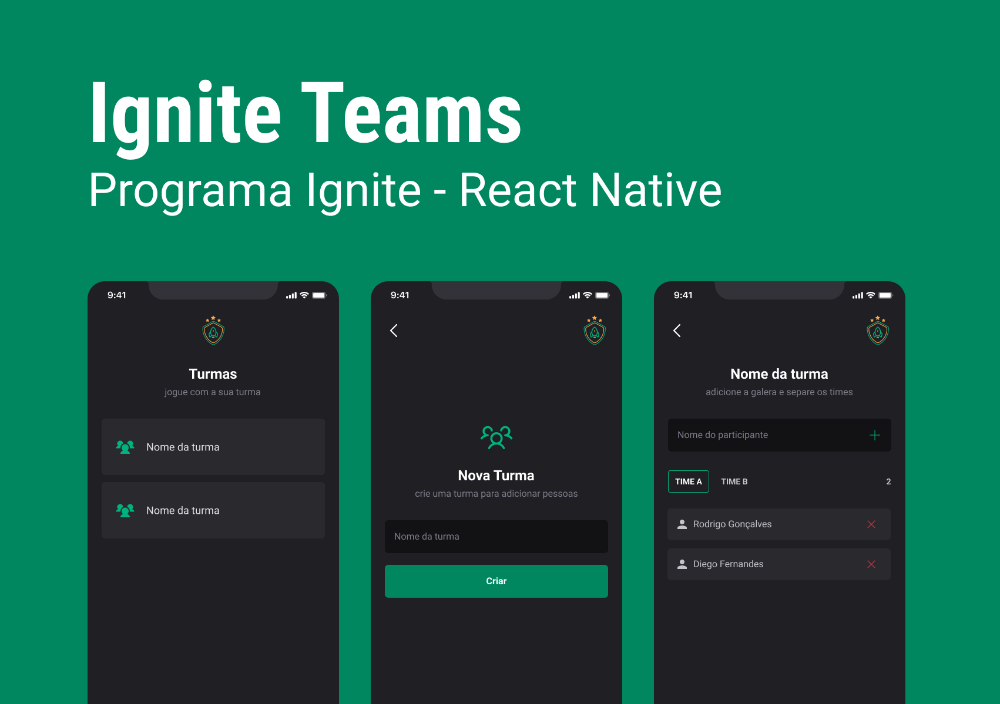

<p align="center">  
    
</p>

<div align="center">


</div>

---

### 📖 Sobre

Projeto 02 desenvolvido durante a aula de React Native (trilha 2023).

<p align="center">  
    
</p>

### 🎨 Protótipo

- Protótipo do projeto está disponível no [Figma](https://www.figma.com/community/file/1151864427495057381) (by [Rocketseat](https://github.com/rocketseat) ❤️).

### 📝 Tecnologias utilizadas

Foram utilizadas as seguintes tecnologias:

- [ReactNative](https://reactnative.dev/)
- [Expo](https://expo.dev/)
- [TypeScript](https://www.typescriptlang.org/)

### 🚀 Como Executar o Projeto

Para executar o projeto, o ambiente deve estar configurado com as ferramentas de desenvolvimento de aplicativos. O passo a passo poderá ser acessado [por aqui](https://react-native.rocketseat.dev/) (by [Rocketseat](https://github.com/rocketseat) ❤️).

```bash
# Clonar o repositório
git clone https://github.com/danilosalvador/igniteteams

# Entrar no diretório
cd igniteteams

# Baixar as dependências
npm install

# Executar
npx expo start

```
### 📝 Licença
Esse projeto está sob a licença MIT. Veja o arquivo [LICENSE](LICENSE) para mais detalhes.
